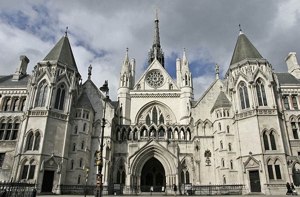

# At the High Court

 I was wondering how it would begin, when the judge pierced the sombre silence of
the court, in an imperiously indignant tone, with “Who is David Powell?!” The echo of
his words in the voluminous but near-empty edifice seemed to convey some
disappointment that, today; Mr Justice Otton had nobody more important than this
David Powell before him. I listened attentively whilst seated between my children,
Nikki and Christian, who were familiar with the Canadian toxic waste, the Russian
ships and the BBC broadcast that had paved my way to the High Court. They also
knew that the writ hanging over me threatened everything we owned. We sat very
still.
 I wasn‟t sure who needed to answer the judge, but I delicately raised a hand and
looked towards him in the distance. I soon suspected that he thought my selfidentification was facetious, as he patronisingly revealed that he already knew who I was and added that he was addressing not me, but my legal opponents. Nevertheless,
perplexed about the point of his question, I couldn‟t help hearing it as an expression of
surprise that it was just me, and not somebody more illustrious, who had been sent
before him on that fateful day. Then I thought, “Perhaps he‟s on my side” and that
his bemusement might not be an expression of disdain towards me, but a sarcastic
rebuke for the people who had put me in that position. I‟ll never know the real
motivation for the judge‟s opening exclamation, though any idea that I had been an
unnecessary victim of Britain‟s libel laws would have matched the feeling that had
consumed me during the past four years.
 Nikki was 16, Christian 15, and it wasn‟t the first time they had accompanied me on
a toxic waste trip. That particular morning, May 17th 1993, we had travelled to
London slowly along the M4 from South Wales in our faded-red Volkswagen Polo.
My wife, Denise, would have been with us too, but for her job in a special needs
school in Pontypool. Since the summer of 1989 I‟d been battling top legal firm
Nabarro Nathanson, who staunchly represented hazardous waste company ReChem
International Limited. Throughout those four years the passing of each day had been a
victory in itself, as I sustained my challenge to the legal action whilst more prosperous
targets of the toxic waste company crumbled and the company accrued more prowess.
Now it was the day of reckoning for me, having being sued in 1989 over a BBC Radio
4 broadcast and an article in the London Evening Standard, both of which related to
my part in combating the importation of toxic waste from Canada. The legal action
against me had been initiated at the time that shipments of PCB waste from Montreal
were heading towards Liverpool Docks. The ultimate destination of the dioxincontaminated material was to be a smoky, smelly incinerator in Pontypool. The plant processed poisons from all over the world and spread its fumes through the Pontypool
neighbourhood of New Inn. Local loathing of the incineration plant had escalated
when the media‟s attention to the toxic shipments was repelled by a salvo of legal
actions from the waste firm, which created panic in the press and which petrified
broadcasters. The power exuded by ReChem‟s unblemished record of libel court
conquests was complemented by the company‟s skill in fending off legal threats about
its own behaviour. The combined characteristics of an invincible attack and an
impenetrable defence meant that the ReChem was doubly despised in the local
community for the way it rode the law. Amongst the widespread, but legally 
unspeakable thoughts about Rechem, was the possibility that the plant was
contaminating its surroundings with PCBs and dioxins. However, the company could
repudiate any idea of wrongdoing by using its mass of monitoring data, with its
authority supported by the scientific community.
 Despite the tendency for the name “ReChem” to be a cue for caution when turning
thoughts into words, in the years before my fateful BBC broadcast I had accumulated a
degree of equity as a spokesman on the toxic waste controversy. I was trusted
throughout the media to comment accurately on the complex subject and before my
intervention in Canadian toxic waste in 1989 there were strong signs that the company
disliked my increasing influence. And it wasn‟t just the company. I also jarred with
some pillars of establishment and, what‟s more, by calling for controls on toxic waste
movement, I was interfering with the politically idolised free market in Britain.
Therefore, when I began my four-year journey to London‟s High Court it was with the
knowledge that I was on the wrong side of the British government, the regulatory
authorities, some leading scientists, the chemical industry and some bastions of the
broadsheet press.
 Before arriving in London on that May morning, towards the end of our journey
from Wales we had been stuck in traffic with the car‟s engine overheating. When we
eventually parked in Hammersmith, being late for The Strand seemed likely but we
three were good runners and our sprints to and from underground stations meant that
my solicitor, Sally Moore, came into sight under the High Court‟s famous arch a few
seconds before the ten-thirty time on the court summons. The tight timing was typical
for me, since time had been in short supply over the whole nine years that I‟d been on
the toxic waste trail and especially during the period spent combating the writ. When
gathering my breath on the steps of the iconic building, and taking in the size and
splendour of the façade, I was relieved that the car hadn‟t broken down, delighted by
arriving on time and overjoyed at seeing Sally on the steps. When I crossed the
threshold of the building, on a path frequently trodden by the famous, wealthy and
powerful, I felt a further lift as the ambience of the building took me back to some
special moments way back in my schooldays. The feeling lightened my step along the
corridor. As the court assembled, the gravity of the occasion did begin to get to me,
but only until the judge asked that opening question “Who is David Powell?” and from
which my own curiosity was also triggered. When I peered into Judge Otton‟s mind to
pry into the reason for that question, the intonation in his “Who?” echoed in my head
and I sought a deep explanation for my being where I was at that time. With a
soothing sense of fate, it was in a flash that a window on my forty-five years of life
opened and I glimpsed what may have predetermined that momentous morning in May
1993.

